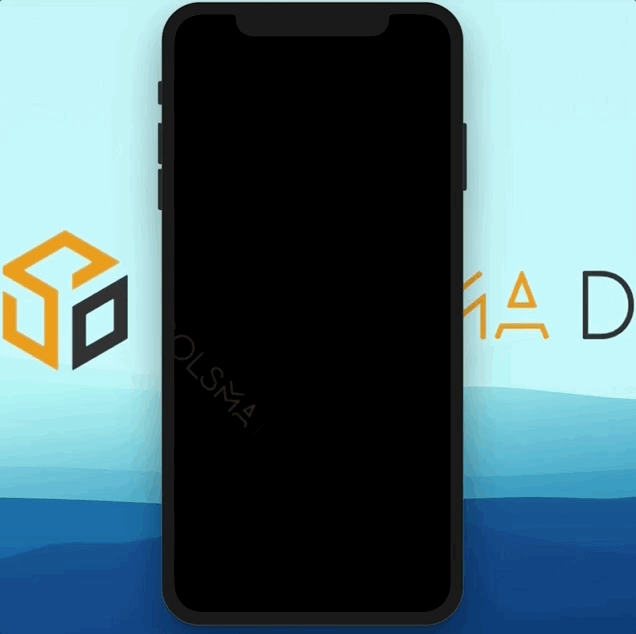
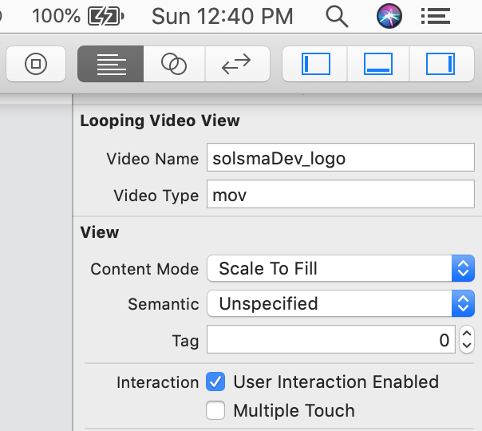

# SDLoopingVideoView

[](https://travis-ci.org/SolsmaHawk/SDLoopingVideoView)
[](https://cocoapods.org/pods/SDLoopingVideoView)
[](https://cocoapods.org/pods/SDLoopingVideoView)
[](https://cocoapods.org/pods/SDLoopingVideoView)
[](https://swift.org)

## Description

SDLoopingVideoView is a looping video-view based off of AVPlayerLayer; it works great when used as a video background (see below for list of apps using SDLoopingVideoView). SDLoopingVideoView automatically scales any video  displayed to aspect-fill the view you define; scaling can be set manually as well. SDLoopingVideoView responds to any UIView animations and scales accordingly without interuption of the video playing.



## Example

To run the example project, clone the repo, and run `pod install` from the Example directory first.

## Requirements

Swift 5.0

## Installation

SDLoopingVideoView is available through [CocoaPods](https://cocoapods.org). To install
it, simply add the following line to your Podfile:

```ruby
pod 'SDLoopingVideoView'
```

## How to use

### Interface Builder

The easiest way to create a ```SDLoopingVideoView``` is to drag and drop a ```UIView``` in interface builder and set its class to ```SDLoopingVideoView```. Then, under the attributes inspector tab, set the ```videoName``` property to the name of your video file and set the ```videoType``` property to the extension of your video file.



### Programatically
You can also initialize an SDLoopingVideoView by declaring it in code:
```
let loopingVideoView = SDLoopingVideoView(frame: CGRect(x: 0, y: 0, width: 100, height: 100), video: .video(fileName: "yourVideoName", fileExtension: .mpg))
```
Or if you want to also include a video to use in darkmode:
```
let loopingVideoViewWithDarkMode = SDLoopingVideoView(frame: CGRect(x: 0, y: 0, width: 100, height: 100), 
video: .video(fileName: "yourVideoName", fileExtension: .mpg), 
darkModeVideo: .video(fileName: "yourDarkModeVideoName", fileExtension: .mov))
```
You can also set scaling for each video separately:

```
let loopingVideoViewWithDarkModeAndCustomScaling = SDLoopingVideoView(frame: CGRect(x: 0, y: 0, width: 100, height: 100), 
video: .video(fileName: "yourVideoName", fileExtension: .mpg, scaling: .resizeAspectFill), 
darkModeVideo: .video(fileName: "yourDarkModeVideoName", fileExtension: .mov, scaling: .resizeAspect))
```

Simple!

### Get Creative
You can setup multiple SDLoopingVideoViews to display simultaneously. (Video game footage taken from [Velocity Breaker](https://itunes.apple.com/us/app/velocity-breaker/id1201572614?mt=8) by Solsma Dev, available in the App Store.)


## Author

John Solsma (Solsma Dev Inc.), solsma@me.com, http://SolsmaDev.com

## Apps using SDLoopingVideoView
If you're using SDLoopingVideoView in a public app, email me (jsolsma@solsmadev.com) and I will add it to the list!

[Velocity Breaker (tvOS + iOS)](https://itunes.apple.com/us/app/velocity-breaker/id1201572614?mt=8)

[Jungle Card Match](https://itunes.apple.com/us/app/jungle-card-match/id1452078620?mt=8)

[IMT Insurance Worry Free App](https://itunes.apple.com/us/app/worry-free/id739974896?mt=8)


## License

SDLoopingVideoView is available under the MIT license. See the LICENSE file for more info.
